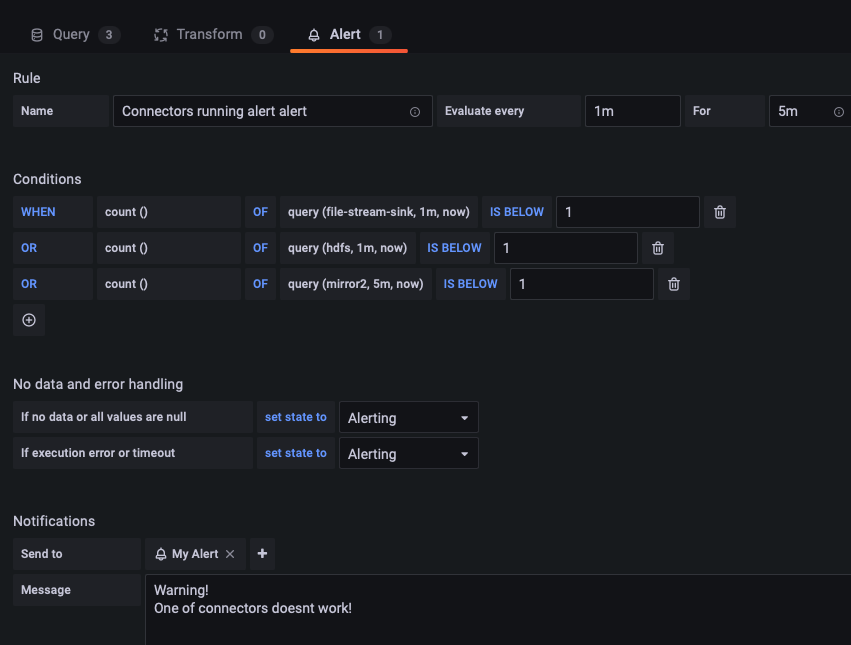
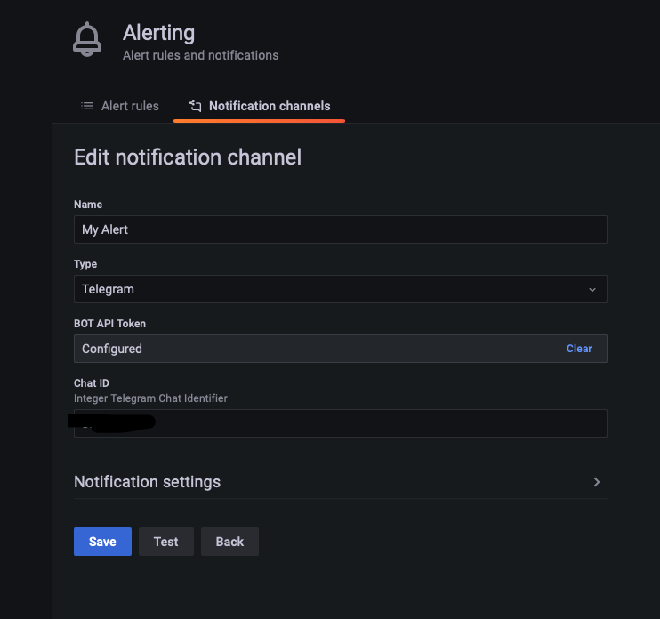
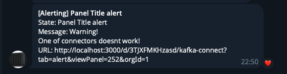
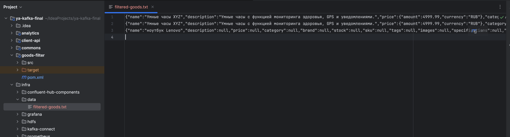

# Kafka final

## Описание docker-compose.yml
* kafka-1-X - первый кластер кафка. Работает на портах 9094-9096 
* kafka-2-X - первый кластер кафка. Работает на портах 9097-9099
* ksqldb-server - ksqldb сервер, порт 8088
* kafka-connect - коннектор, использующийся для зеркалирования кластера, загрузки данных о товарах в файл и в hdfs, порт 8083
* ui - веб интерфейс для кафки, порт 8085
* hadoop-namenode - неймнода хадупа, порт 9000 для доступа, 9870 - web-ui
* hadoop-datanode-X - датаноды
* analytics - сервис аналитики для предоставления рекомендаций
* prometheus - порт 9090
* grafana - порт 3000

## Описание модулей
* commons - модуль с общими классами
* analytics - модуль аналитики и предоставления рекомендаций. Читает hdfs и пишет рекомендации в кафка
* client-api - клиентское приложение. позволяет искать по существующим товарам, отправляя поисковые запросы в кафку, и получать рекомендации
* shop-api - позволяет отправлять товары в кафку, читая файл data.json
* goods-filter - отвечает за фильтарцию товаров, читает raw топик, и пишет в отфильтрованный

## Сборка и запуск
1. Соберем проект
```bash
mvn clean package
```
2. Запустим докер и все контейнеры
```bash
docker-compose up -d
```
3. Создадим топики с помощтю скрипта create-topics.sh. В нем же содержится краткое описание топиков
4. Запустим коннекторы run-connectors.sh
5. Создадим ksql таблицу recommendations.sh
6. Импортируем в графану дешборд infra/grafana/dashboards/Kafka Connect.json
7. Настроим алерты:  
  
  
Убедимся, что они приходят в Телеграм  


8. Запустим фильтр товаров
```bash
java -jar ./goods-filter/target/goods-filter-1.0-SNAPSHOT-jar-with-dependencies.jar
```
9. Создадим фильтр для товара. Отправим в топик balcklist сообщение вида
```json
{
  "goodsName": "ноутбук",
  "add": true
}
```
Добавляем в черный список ноутбуки
```bash
echo '{"goodsName": "ноутбук", "add": true}' | kafka-console-producer.sh --broker-list localhost:9094 --topic app-blacklist-goods
```
В логе фильтра видим:
```log
[goods-filter-d1915dca-164a-44ce-a16b-ade51703914c-StreamThread-1] INFO ru.yakovlev.filter.BlacklistFilter - Adding goodsName 'ноутбук' to stop list
```
Бросим в топик сообщение с ноутбуком
```bash
echo '{ "product_id": "12345", "name": "ноутбук Lenovo"}' | kafka-console-producer.sh --broker-list localhost:9094 --topic app-raw-goods
```
И увидим в логе фильтра
```log
[goods-filter-d1915dca-164a-44ce-a16b-ade51703914c-StreamThread-1] INFO ru.yakovlev.filter.BlacklistFilter - Goods Product(productId=12345, name=ноутбук Lenovo, description=null, price=null, category=null, brand=null, stock=null, sku=null, tags=null, images=null, specifications=null, createdAt=null, updatedAt=null, index=null, storeId=null) did not pass blacklist
```
Прочитаем топик с отфильтрованными сообщениями и убедимся, что в нем нет ноутбуков:
```bash
kafka-console-consumer.sh --bootstrap-server localhost:9094 --topic app-filtered-goods --from-beginning
```
```log
{"name":"Умные часы XYZ","description":"Умные часы с функцией мониторинга здоровья, GPS и уведомлениями.","price":{"amount":4999.99,"currency":"RUB"},"category":"Электроника","brand":"XYZ","stock":{"available":150,"reserved":20},"sku":"XYZ-12345","tags":["умные часы","гаджеты","технологии"],"images":[{"url":"https://example.com/images/product1.jpg","alt":"Умные часы XYZ - вид спереди"},{"url":"https://example.com/images/product1_side.jpg","alt":"Умные часы XYZ - вид сбоку"}],"specifications":{"weight":"50g","dimensions":"42mm x 36mm x 10mm","battery_life":"24 hours","water_resistance":"IP68"},"index":"products","product_id":"12345","created_at":1696161600000,"updated_at":1696951800000,"store_id":"store_001"}
{"name":"Умные часы XYZ","description":"Умные часы с функцией мониторинга здоровья, GPS и уведомлениями.","price":{"amount":4999.99,"currency":"RUB"},"category":"Электроника","brand":"XYZ","stock":{"available":150,"reserved":20},"sku":"XYZ-12345","tags":["умные часы","гаджеты","технологии"],"images":[{"url":"https://example.com/images/product1.jpg","alt":"Умные часы XYZ - вид спереди"},{"url":"https://example.com/images/product1_side.jpg","alt":"Умные часы XYZ - вид сбоку"}],"specifications":{"weight":"50g","dimensions":"42mm x 36mm x 10mm","battery_life":"24 hours","water_resistance":"IP68"},"index":"products","product_id":"12345","created_at":1696161600000,"updated_at":1696951800000,"store_id":"store_001"}
```

10. Удалим товар из черного списка, отправив сообщение вида. Затем бросим сообщение с ноутбуком
```json
{
  "goodsName": "ноутбук",
  "add": false
}
```
```bash
echo '{"goodsName": "ноутбук", "add": false}' | kafka-console-producer.sh --broker-list localhost:9094 --topic app-blacklist-goods 
echo '{ "product_id": "12345", "name": "ноутбук Lenovo"}' | kafka-console-producer.sh --broker-list localhost:9094 --topic app-raw-goods
```
В логе фильтра
```log
[goods-filter-87e4f76a-9582-4a68-930e-599b28e53c47-StreamThread-1] INFO ru.yakovlev.filter.BlacklistFilter - Removing goodsName 'ноутбук' from stop list
```
Прочитаем сообщения
```bash
kafka-console-consumer.sh --bootstrap-server localhost:9094 --topic app-filtered-goods --from-beginning
```
```log
{"name":"Умные часы XYZ","description":"Умные часы с функцией мониторинга здоровья, GPS и уведомлениями.","price":{"amount":4999.99,"currency":"RUB"},"category":"Электроника","brand":"XYZ","stock":{"available":150,"reserved":20},"sku":"XYZ-12345","tags":["умные часы","гаджеты","технологии"],"images":[{"url":"https://example.com/images/product1.jpg","alt":"Умные часы XYZ - вид спереди"},{"url":"https://example.com/images/product1_side.jpg","alt":"Умные часы XYZ - вид сбоку"}],"specifications":{"weight":"50g","dimensions":"42mm x 36mm x 10mm","battery_life":"24 hours","water_resistance":"IP68"},"index":"products","product_id":"12345","created_at":1696161600000,"updated_at":1696951800000,"store_id":"store_001"}
{"name":"Умные часы XYZ","description":"Умные часы с функцией мониторинга здоровья, GPS и уведомлениями.","price":{"amount":4999.99,"currency":"RUB"},"category":"Электроника","brand":"XYZ","stock":{"available":150,"reserved":20},"sku":"XYZ-12345","tags":["умные часы","гаджеты","технологии"],"images":[{"url":"https://example.com/images/product1.jpg","alt":"Умные часы XYZ - вид спереди"},{"url":"https://example.com/images/product1_side.jpg","alt":"Умные часы XYZ - вид сбоку"}],"specifications":{"weight":"50g","dimensions":"42mm x 36mm x 10mm","battery_life":"24 hours","water_resistance":"IP68"},"index":"products","product_id":"12345","created_at":1696161600000,"updated_at":1696951800000,"store_id":"store_001"}
{ "product_id": "12345", "name": "ноутбук Lenovo"}
```

12. Как видим на скриншоте, данные записались в файл


13. Запустим client-api. Убедимся, что работает поиск и выставление рекомендаций.